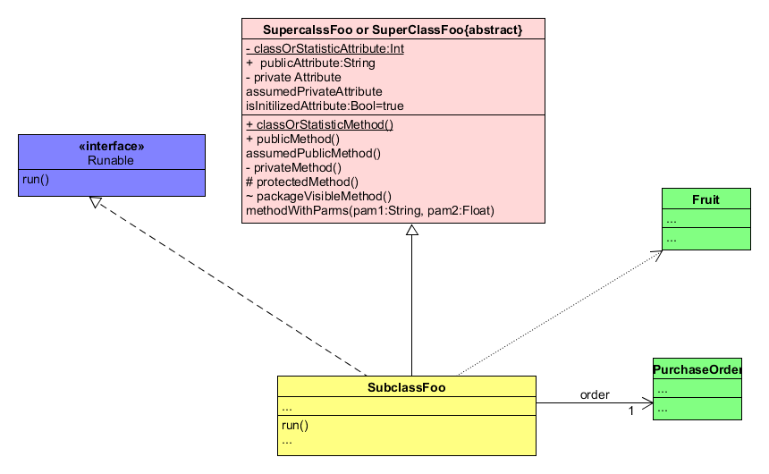

# 1、简答题

- 用简短的语言给出对分析、设计的理解。

  分析是对问题和需求的调查，而不是找解决办法，也就是做对的事情。设计是为了满足需求而做的一些概念上的解决办法，而不是编码实现，强调的是把事情做对。

  

- 用一句话描述面向对象的分析与设计的优势。

  面向对象的分析和设计，它的语言具有一致性（在同一时期同时描述问题和解决方案）；过程具有一致性（从需求到测试，所有的过程采用相同的语义构造）。

  

- 简述 UML（统一建模语言）的作用。考试考哪些图？

  - 用例图：用户角度：功能、执行者
  - 静态图：系统静态结构
    - 类图：概念及关系
    - 对象图：某种状态或时间段内，系统中活跃的对象及其关系
    - 包图：描述系统的分解结构
  - 行为图：系统的动态行为
    - 交互图：描述对象间的消息传递
      - 顺序图：强调对象间消息发送的时序
      - 合作图：强调对象间的动态协作关系
    - 状态图：对象的动态行为。状态-事件-状态迁移-响应动作
    - 活动图：描述系统为完成某功能而执行的操作序列
  - 实现图：描述系统的组成和分布状况
    - 构件图：组成部件及其关系
    - 部署图：物理体系结构及与软件单元的对应关系 

  

- 从软件本质的角度，解释软件范围（需求）控制的可行性

  软件本质是，它具有一致性、复杂性、易变性、不可视性。一个软件它的业务逻辑往往是很复杂的，需求又会经常性发生变化，并且很多情况下客户和开发者都不知道确切的软件需求，所以想要一开始就非常准确的控制软件需求是不可能的，需求会随着不断地探索逐渐的清晰。所以软件范围的控制是很有难度的，必须经过客户和开发者的充分讨论，并且确定《软件需求规格说明书》才行，这样可以防止需求发生太大的变化，有效降低开发成本，提高开发效率。

# 2、项目管理实践

- 看板

我直接在github的仓库下，建立了一个project。使用它的看板功能。

它里面默认有三个模块，todo， in progress, done,也可以自己添加或者删除模块。

每个模块内可以添加note，如果完成该note，就可以选择achive从该模块移除note。

界面的左上角有一个“血条”，它被分成三个部分，绿色代表todo里面note的数量在总的note中所占的比例，蓝色代表in progress,灰色代表done

 

- UML（课本181页，图16-1）

  - 可以通过在编辑器中输入bg=pink， fg=black把背景设为粉色，前景设为黑色。
  - 通过把属性或者方法用一对“_"下划线括起来，给其加上下划线。
  - 通过把接口名或者类名用一对“*"星号括起来，将其加粗
  - 两个连续的小短线”--“是一条分割线
  - ”//“两个斜杠之间的内容斜体。

 
