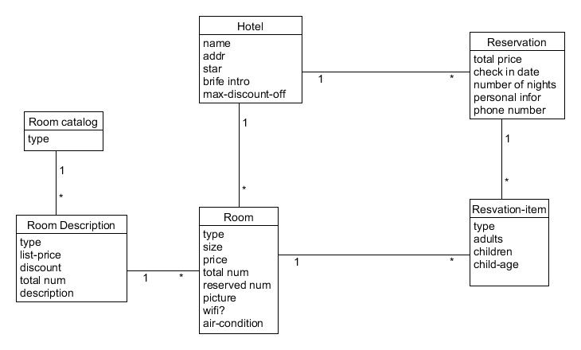
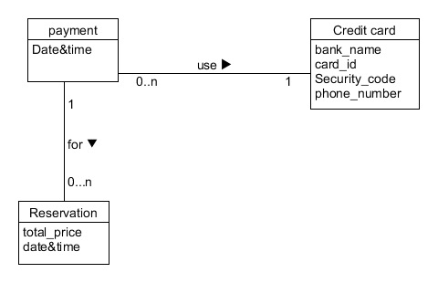
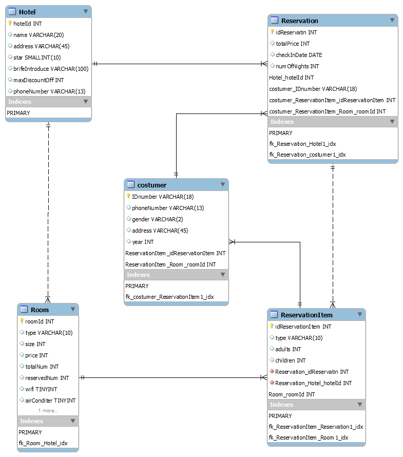
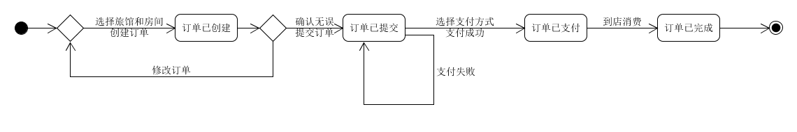

<center><h1>领域建模</h1></center>


- 1、使用类图，分别对 Asg_RH 文档中 Make Reservation 用例以及 Payment 用例开展领域建模。然后，根据上述模型，给出建议的数据表以及主要字段，特别是主键和外键

  - 注意事项：
    - 对象必须是名词、特别是技术名词、报表、描述类的处理；
    - 关联必须有多重性、部分有名称与导航方向
    - 属性要注意计算字段

  Make Reservation建模：

  ​	

  

  payment建模：

  

  - 数据建模，为了简化描述仅需要给出表清单，例如：
    - Hotel（ID/Key，Name，LoctionID/Fkey，Address…..）

  

  从mySQL导出脚本：

  ```sql
  
  -- MySQL Script generated by MySQL Workbench
  -- Sun May  5 15:52:00 2019
  -- Model: New Model    Version: 1.0
  -- MySQL Workbench Forward Engineering
  
  SET @OLD_UNIQUE_CHECKS=@@UNIQUE_CHECKS, UNIQUE_CHECKS=0;
  SET @OLD_FOREIGN_KEY_CHECKS=@@FOREIGN_KEY_CHECKS, FOREIGN_KEY_CHECKS=0;
  SET @OLD_SQL_MODE=@@SQL_MODE, SQL_MODE='ONLY_FULL_GROUP_BY,STRICT_TRANS_TABLES,NO_ZERO_IN_DATE,NO_ZERO_DATE,ERROR_FOR_DIVISION_BY_ZERO,NO_ENGINE_SUBSTITUTION';
  
  -- -----------------------------------------------------
  -- Schema mydb
  -- -----------------------------------------------------
  
  -- -----------------------------------------------------
  -- Schema mydb
  -- -----------------------------------------------------
  CREATE SCHEMA IF NOT EXISTS `mydb` DEFAULT CHARACTER SET utf8 ;
  USE `mydb` ;
  
  -- -----------------------------------------------------
  -- Table `mydb`.`table1`
  -- -----------------------------------------------------
  CREATE TABLE IF NOT EXISTS `mydb`.`table1` (
  )
  ENGINE = InnoDB;
  
  
  -- -----------------------------------------------------
  -- Table `mydb`.`table2`
  -- -----------------------------------------------------
  CREATE TABLE IF NOT EXISTS `mydb`.`table2` (
  )
  ENGINE = InnoDB;
  
  
  -- -----------------------------------------------------
  -- Table `mydb`.`table3`
  -- -----------------------------------------------------
  CREATE TABLE IF NOT EXISTS `mydb`.`table3` (
  )
  ENGINE = InnoDB;
  
  
  -- -----------------------------------------------------
  -- Table `mydb`.`Hotel`
  -- -----------------------------------------------------
  CREATE TABLE IF NOT EXISTS `mydb`.`Hotel` (
    `hotelId` INT NOT NULL,
    `name` VARCHAR(20) NULL,
    `address` VARCHAR(45) NULL,
    `star` SMALLINT(10) NULL,
    `brifeIntroduce` VARCHAR(100) NULL,
    `maxDiscountOff` INT NULL,
    `phoneNumber` VARCHAR(13) NULL,
    PRIMARY KEY (`hotelId`))
  ENGINE = InnoDB;
  
  
  -- -----------------------------------------------------
  -- Table `mydb`.`Room`
  -- -----------------------------------------------------
  CREATE TABLE IF NOT EXISTS `mydb`.`Room` (
    `roomId` INT NOT NULL,
    `type` VARCHAR(10) NULL,
    `size` INT NULL,
    `price` INT NULL,
    `totalNum` INT NULL,
    `reservedNum` INT NULL,
    `wifi` TINYINT NULL,
    `airConditer` TINYINT NULL,
    `Hotel_hotelId` INT NOT NULL,
    PRIMARY KEY (`roomId`),
    INDEX `fk_Room_Hotel_idx` (`Hotel_hotelId` ASC) VISIBLE,
    CONSTRAINT `fk_Room_Hotel`
      FOREIGN KEY (`Hotel_hotelId`)
      REFERENCES `mydb`.`Hotel` (`hotelId`)
      ON DELETE NO ACTION
      ON UPDATE NO ACTION)
  ENGINE = InnoDB;
  
  
  -- -----------------------------------------------------
  -- Table `mydb`.`ReservationItem`
  -- -----------------------------------------------------
  CREATE TABLE IF NOT EXISTS `mydb`.`ReservationItem` (
    `idReservationItem` INT NOT NULL,
    `type` VARCHAR(10) NULL,
    `adults` INT NULL,
    `children` INT NULL,
    `Reservation_idReservatin` INT NOT NULL,
    `Reservation_Hotel_hotelId` INT NOT NULL,
    `Room_roomId` INT NOT NULL,
    PRIMARY KEY (`idReservationItem`, `Room_roomId`),
    INDEX `fk_ReservationItem_Reservation1_idx` (`Reservation_idReservatin` ASC, `Reservation_Hotel_hotelId` ASC) VISIBLE,
    INDEX `fk_ReservationItem_Room1_idx` (`Room_roomId` ASC) VISIBLE,
    CONSTRAINT `fk_ReservationItem_Reservation1`
      FOREIGN KEY (`Reservation_idReservatin` , `Reservation_Hotel_hotelId`)
      REFERENCES `mydb`.`Reservation` (`idReservatin` , `Hotel_hotelId`)
      ON DELETE NO ACTION
      ON UPDATE NO ACTION,
    CONSTRAINT `fk_ReservationItem_Room1`
      FOREIGN KEY (`Room_roomId`)
      REFERENCES `mydb`.`Room` (`roomId`)
      ON DELETE NO ACTION
      ON UPDATE NO ACTION)
  ENGINE = InnoDB;
  
  
  -- -----------------------------------------------------
  -- Table `mydb`.`costumer`
  -- -----------------------------------------------------
  CREATE TABLE IF NOT EXISTS `mydb`.`costumer` (
    `IDnumber` VARCHAR(18) NOT NULL,
    `phoneNumber` VARCHAR(13) NULL,
    `gender` VARCHAR(2) NULL,
    `address` VARCHAR(45) NULL,
    `year` INT NULL,
    `ReservationItem_idReservationItem` INT NOT NULL,
    `ReservationItem_Room_roomId` INT NOT NULL,
    PRIMARY KEY (`IDnumber`, `ReservationItem_idReservationItem`, `ReservationItem_Room_roomId`),
    INDEX `fk_costumer_ReservationItem1_idx` (`ReservationItem_idReservationItem` ASC, `ReservationItem_Room_roomId` ASC) VISIBLE,
    CONSTRAINT `fk_costumer_ReservationItem1`
      FOREIGN KEY (`ReservationItem_idReservationItem` , `ReservationItem_Room_roomId`)
      REFERENCES `mydb`.`ReservationItem` (`idReservationItem` , `Room_roomId`)
      ON DELETE NO ACTION
      ON UPDATE NO ACTION)
  ENGINE = InnoDB;
  
  
  -- -----------------------------------------------------
  -- Table `mydb`.`Reservation`
  -- -----------------------------------------------------
  CREATE TABLE IF NOT EXISTS `mydb`.`Reservation` (
    `idReservatin` INT NOT NULL,
    `totalPrice` INT NULL,
    `checkInDate` DATE NULL,
    `numOfNights` INT NULL,
    `Hotel_hotelId` INT NOT NULL,
    `costumer_IDnumber` VARCHAR(18) NOT NULL,
    `costumer_ReservationItem_idReservationItem` INT NOT NULL,
    `costumer_ReservationItem_Room_roomId` INT NOT NULL,
    PRIMARY KEY (`idReservatin`, `Hotel_hotelId`, `costumer_IDnumber`, `costumer_ReservationItem_idReservationItem`, `costumer_ReservationItem_Room_roomId`),
    INDEX `fk_Reservation_Hotel1_idx` (`Hotel_hotelId` ASC) VISIBLE,
    INDEX `fk_Reservation_costumer1_idx` (`costumer_IDnumber` ASC, `costumer_ReservationItem_idReservationItem` ASC, `costumer_ReservationItem_Room_roomId` ASC) VISIBLE,
    CONSTRAINT `fk_Reservation_Hotel1`
      FOREIGN KEY (`Hotel_hotelId`)
      REFERENCES `mydb`.`Hotel` (`hotelId`)
      ON DELETE NO ACTION
      ON UPDATE NO ACTION,
    CONSTRAINT `fk_Reservation_costumer1`
      FOREIGN KEY (`costumer_IDnumber` , `costumer_ReservationItem_idReservationItem` , `costumer_ReservationItem_Room_roomId`)
      REFERENCES `mydb`.`costumer` (`IDnumber` , `ReservationItem_idReservationItem` , `ReservationItem_Room_roomId`)
      ON DELETE NO ACTION
      ON UPDATE NO ACTION)
  ENGINE = InnoDB;
  
  
  SET SQL_MODE=@OLD_SQL_MODE;
  SET FOREIGN_KEY_CHECKS=@OLD_FOREIGN_KEY_CHECKS;
  SET UNIQUE_CHECKS=@OLD_UNIQUE_CHECKS;
  
  
  ```

  

- 2、使用 UML State Model，对每个订单对象生命周期建模

  - 建模对象： 参考 Asg_RH 文档， 对 Reservation/Order 对象建模。
  - 建模要求： 参考练习不能提供足够信息帮助你对订单对象建模，请参考现在 定旅馆 的旅游网站，尽可能分析围绕订单发生的各种情况，直到订单通过销售事件（柜台销售）结束订单。
  
  
